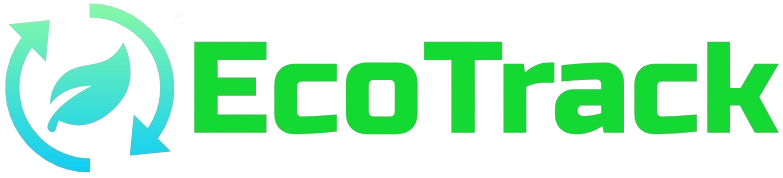

<div align="center">
  <br />
     <a href="#" target="_blank">
        
      </a>
  <br />
  <h1 align="center">AI-Powered Waste Management Platform</h1>
  <div>
    
    
    
    
    
    
    
    
  </div>
  <br/>
   <div align="center">
     EcoTrack is a waste management app built with Next.js, TypeScript, TailwindCSS, and Gemini AI. It offers real-time waste tracking and smart insights. Powered by Drizzle for database management, EcoTrack is scalable, responsive, and designed for eco-conscious communities.
    </div>
</div>

## 📋 <a name="table">Table of Contents</a>

1. 🤖 [Introduction](#introduction)
2. ⚙️ [Tech Stack](#tech-stack)
3. 🔋 [Features](#features)
4. 🤸 [Quick Start](#quick-start)

## <a name="introduction">🤖 Introduction</a>

Built with Next.js, EcoTrack is scalable, responsive, and designed to promote sustainable living and it offers real-time waste tracking and smart insights to help eco-conscious communities manage their waste efficiently.

## <a name="tech-stack">⚙️ Tech Stack</a>

- Next.js
- TypeScript
- TailwindCSS
- ShadCN UI
- Web3Auth
- Gemini AI
- Google Maps
- Drizzle

## <a name="features">🔋 Features</a>

👉 **Authentication**: An ultra-secure SSR authentication with proper validations and authorization

👉 **Real-Time Waste Tracking**: Real-time tracking of waste collection activities, monitoring waste management efforts accurately and efficiently

👉 **Smart Insights**: Leveraging the power of Gemini AI, intelligent insights and analytics to make informed decisions about their waste management practices

👉 **Home Page**: Shows general overview of user account with waste management activities, overall impacts, etc

👉 **Data Transactions**: Robust and efficient database management, ensuring data integrity and performance

👉 **Community Focus**: Tailored for eco-conscious communities, promoting sustainable living through effective waste management solutions

👉 **Sleek User Interface**: Offers a modern and intuitive user interface, enhancing the overall user experience

👉 **Responsiveness**: Ensures the application adapts seamlessly to various screen sizes and devices, providing a consistent user experience across desktop, tablet, and mobile platforms.

and many more, including code architecture and reusability.

## <a name="quick-start">🤸 Quick Start</a>

Follow these steps to set up the project locally on your machine.

**Prerequisites**

Make sure you have the following installed on your machine:

- [Git](https://git-scm.com/)
- [Node.js](https://nodejs.org/en)
- [npm](https://www.npmjs.com/) (Node Package Manager)

**Cloning the Repository**

```bash
git clone https://github.com/MenathNDGD/EcoTrack.git
cd EcoTrack
```

**Installation**

Install the project dependencies using npm:

```bash
npm install
```

**Set Up Environment Variables**

Create a new file named `.env` in the root of your project and add the following content:

```env
NEXT_PUBLIC_DATABASE_URL=

NEXT_PUBLIC_WEB3_AUTH_CLIENT_ID=

NEXT_PUBLIC_GEMINI_API_KEY=

NEXT_PUBLIC_GOOGLE_MAPS_API_KEY=
```

Replace the placeholder values with your actual respective account credentials.

**Running the Project**

Generate and push the database migrations using Drizzle:

```bash
npx drizzle-kit generate
npx drizzle-kit push
```

Run the project on localhost server:

```bash
npm run dev
```

Open [http://localhost:3000](http://localhost:3000) in your browser to view the project.
